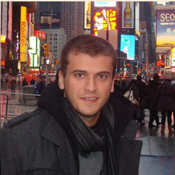

## About Me

Hello. I am working as a Research Associate in the [Department of Informatics](https://www.kcl.ac.uk/nms/depts/informatics/index.aspx) at [King's College London](https://www.kcl.ac.uk). My ongoing project is the European Robotic Goal-Oriented [ERGO](http://h2020-ergo.gmv.com/author/ergo/) Autonomous Controller Project. I actively work on the development of an AI planning software, called **Stellar**, to be run on-board autonomous spacecraft that will be launched by the *European Space Agency (ESA)*. I also manage the integration tests of Stellar with the rest of robotic components on simulation and physical environments. 

## Research Interest

I am particularly interested in AI planning applications in the fields of robotic and manufacturing in temporal and numeric settings. I have successfully defended my thesis, **Temporal-Numeric Planning with Control Parameters** on June 2018. During my PhD studies, I have extended a standardised planning language, [**PDDL**](https://en.wikipedia.org/wiki/Planning_Domain_Definition_Language), to reason about flexible numeric parameters (we called them *Control Parameters*) that can take their values from considerably large-sized domains. I have developed an AI planning software, called **POPCORN**, that can reason about these parameters. My motivation on this work was to model and encapsulate controllable dynamics of the real-world environment in AI planning frameworks. I successfully applied this planning paradigm as a case study on a Task and Motion Planning (TAMP) application as a part of the EU-Funded [SQUIRREL](http://www.squirrel-project.eu/) Project.

## Softwares
You can find the source code of the POPCORN planner and the MILP compilation work that I collaborated with Chiara Piacentini [on my GitHub repository](https://github.com/Emresav/popcorn). You can also access the Scala and Java template codes that I commonly use on [here](https://github.com/Emresav/).

---
## Education

Here is my decade-long higher education list. 

Year of Award | Degree | University
--------------|--------|--------------
2018 | PhD in Computer Science | King's College London
2014 | MSc in Engineering with Management | King's College London
2013 | BSc in Industrial Engineering | Istanbul Technical University
2013 | BSc in Ind. and Manuf. Engineering | Southern Illinois University Edwardsville

---
## Publications

1. Emre Savas, Maria Fox, Derek Long, and Daniele Magazzeni. [Planning Using Actions with Control Parameters](https://kclpure.kcl.ac.uk/portal/files/56331945/FAIA285_1185.pdf). *In Proceedings of the 22nd European Conference on Artificial Intelligence (ECAI 2016)*, 2016

2. Emre Savas, Chiara Piacentini. [Extending a MILP Compilation for Numeric Planning Problems to Include Control Parameters](https://kclpure.kcl.ac.uk/portal/files/101130585/CP2018_workshop_1_.pdf). *Constraints and AI Planning Workshop of the 24th International Conference on Principles and Practice of Constraint Programming (CP 2018)*, 2018

3. Jorge Ocón, Francisco Colmenero, Joaquín Estremera, Karl Buckley, Mercedes Alonso, Enrique Heredia, Javier Garcia, Andrew Ian Coles, Amanda Jane Coles, Moises Martinez Munoz, Okkes Emre Savas, Florian Pommerening, Thomas Keller, Spyros Karachalios, Mark Woods, Iulia Dragomir, Saddek Bensalem, Pierre Dissaux, Arnaud Schach. [The ERGO framework and Its Use in Planetary/Orbital Scenarios](https://kclpure.kcl.ac.uk/portal/en/publications/the-ergo-framework-and-its-use-in-planetaryorbital-scenarios(ad3d6117-56c4-42bf-90d6-c1f25db897e0).html). *Proceedings of the 69th International Astronautical Congress (IAC)*, 2018

4. Emre Okkes Savas. [Dissertation Abstract](http://icaps16.icaps-conference.org/proceedings/dc/dc16.pdf#page=61). *International Conference on Automated Planning and Scheduling Doctoral Consortium (ICAPS 2016)*, 2016

5. Emre Okkes Savas, Maria Fox, Derek Long, and Daniele Magazzeni. Task Planning with Control Parameters. *In Proceedings of the 33rd Workshop of the UK Planning and Scheduling Special Interest Group (PlanSIG 2016)*, 2016

6. Michael Cashmore, Maria Fox, Derek Long, Daniele Magazzeni, Bram Ridder, Emre Savas. ROSPlan: Planning in the Robot Operating System. *In Proceedings of the 6th Italian Workshop on Planning and Scheduling (IPS 2015)*, 2015

<!--- 3. Amanda Coles, Andrew Coles, Moises Martinez, Emre Savas, Juan Manuel Delfa, Tomas de la Rosa, Yolanda E-Martin, Angel Garcia-Olaya. Efficiently Reasoning with Interval Constraints in Forward Search Planning, *AAAI 2019*, under revision
--->
---

## PhD Supervisors
* [Prof Derek Long](https://www.kcl.ac.uk/nms/depts/informatics/people/atoz/longd.aspx)
* [Prof Maria Fox](https://www.kcl.ac.uk/nms/depts/informatics/people/atoz/foxm.aspx)

---

> *"I got something that makes me want to shout, I got something that tells me what it's all about. I'm superbad!"* -- James Brown.
